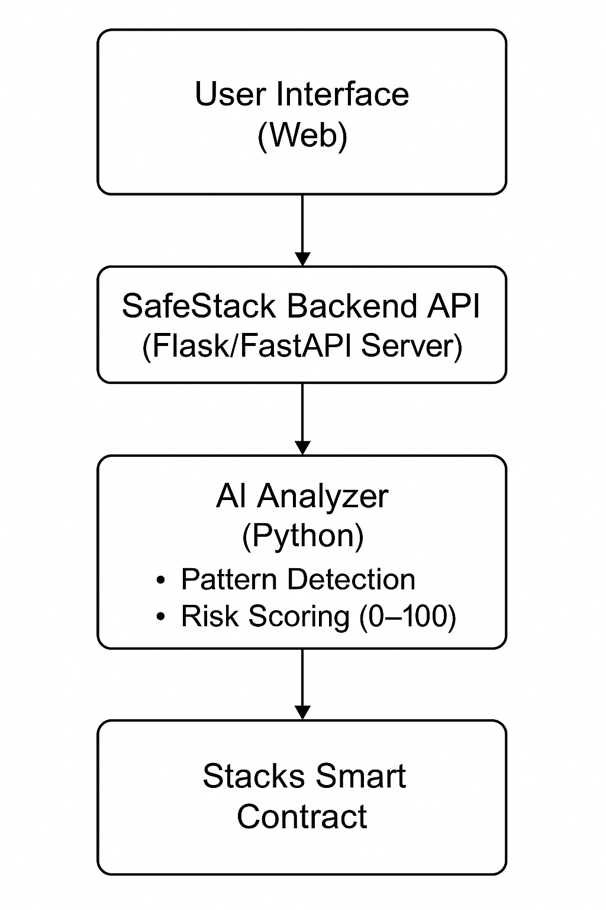

# 🔒 SafeStack — AI-Powered Smart Contract Safety on Stacks

**SafeStack** is an **AI-powered DeFi security assistant** built on the **Stacks blockchain**.  
It empowers investors to **verify the safety and trustworthiness of smart contracts** before interacting with them.  

By combining **AI analysis** and **blockchain transparency**, SafeStack makes decentralized finance safer, simpler, and more accessible — especially for non-technical investors who want peace of mind before investing.

---

## 🚀 Project Overview

| Category | Details |
|-----------|----------|
| **Project Name** | SafeStack |
| **Hackathon** | Stacks Vibe Coding Hackathon 2025 |
| **Theme** | DeFi + AI Integration |
| **Goal** | Protect investors by detecting risky or malicious smart contracts using AI |
| **Built With** | Python • Clarity • Stacks API • stacks.js |

---

## 🚀 Phase 1 Summary

| Element | Description |
|----------|--------------|
| **Problem** | DeFi investors lose money to unsafe contracts and lack easy-to-use safety tools. |
| **Solution** | SafeStack — an AI-driven platform that analyzes and rates smart contract safety on Stacks. |
| **Evidence** | $1.9B in DeFi hacks, 70% unaware of risks, 90% want AI-powered safety tools. |
| **Feasibility** | Uses Python, AI models, and Stacks API to deliver instant safety analysis. |

---

✅ **Status:** Phase 1 complete.

---

## 🧱 Development Phases

| Phase | Description | Status | Link |
|-------|--------------|--------|------|
| 1️⃣ Validate | Problem definition & research | ✅ Complete | [PHASE 1](./docs/PHASE_1_VALIDATE.md) |
| 2️⃣ Build | Design & Prototype | 🟡 In Progress | [PHASE 2](./docs/PHASE_2_BUILD.md) |
| 3️⃣ Pitch | Demo & Final Presentation | 🔜 Next | Coming soon |

---

A Flowchart Diagram Depicting The SafeStack System

---

cat > README.md <<'EOF'
# SafeStack — Phase 2 Prototype

This prototype accepts a contract address or pasted contract code and returns a mock safety score, findings, and a plain-language explanation.

Run locally: see docs/PHASE_2_BUILD.md
EOF

